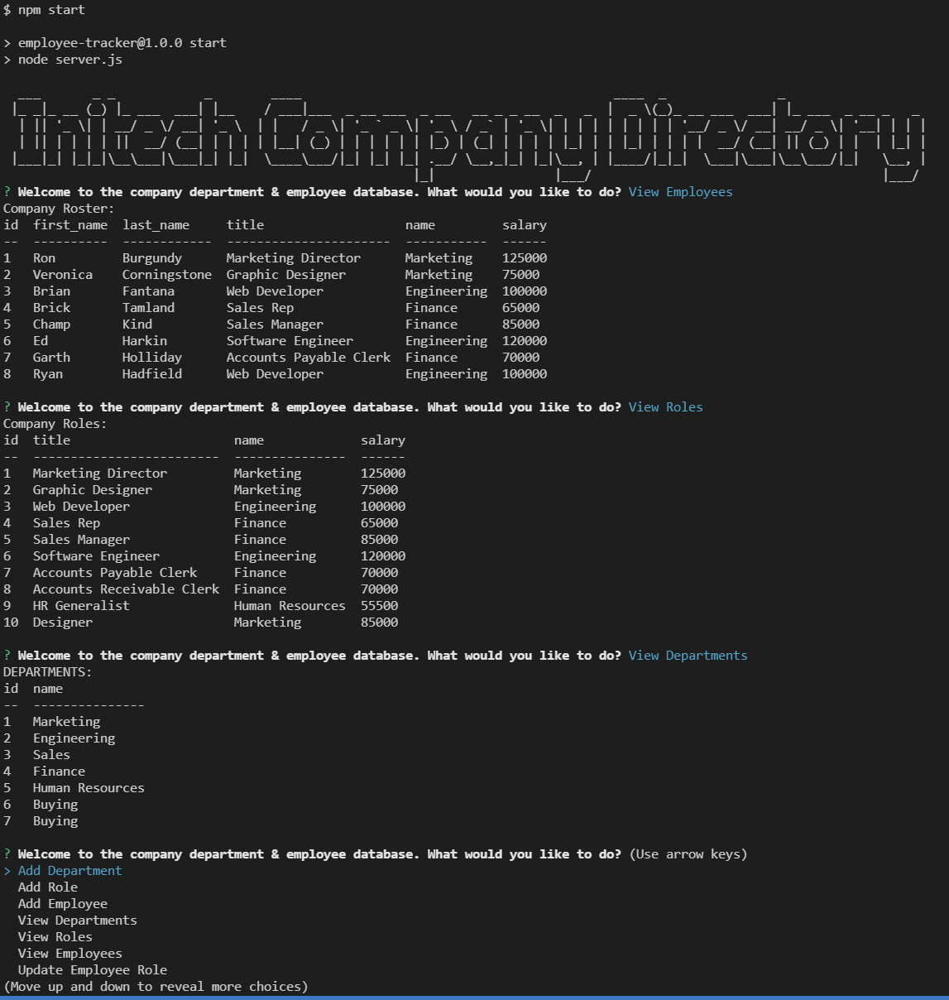

# Employee-Tracker

## Description
This app is Content Management System for managing a company's employees using node, inquirer, and MySQL.

This is a command line application that allows the following:
* Add departments, roles, employees

* View departments, roles, employees

* Update employee roles


Link to walk-through [video](https://drive.google.com/file/d/1U4YTgorxugiH_uMRknTCuNnmBQqEmhPi/view?usp=sharing) of how to use this app. 

 ---

## Table of Contents (Optional)

- [Installation](#installation)
- [Usage](#usage)
- [Credits](#credits)
- [License](#license)

---

## Installation

- In order to run this application you'll need to make sure you have [NodeJS](https://nodejs.org/en/) installed on your computer.
- You can run this app through the integrated terminal in your [Visual Studio Code (VS CODE)](https://code.visualstudio.com/).
- You'll need to clone this app onto your computer
- Once you have the integrated terminal open in VS code for this app, run an ```npm i``` in the terminal.
- This should install a package-lock.jason file and node_modules.
- From here you'll want to type ```npm start``` in your integrated terminal to initiate the application.

---

## Usage

You can quickly and easily view employees, roles/titles, and departments for the already populated database.  You can add employees, roles, and departments to this database as well.  Finally you are able to edit and update an employees information.

Once the application has been installed and initiated as per the above instructions you'll be prompted with a series of menus and questions in your integrated terminal.



Design of the database schema containing three tables:


---

## Links
* [Github](https://github.com/ryanhadfield/Employee-Tracker)
* [Video Walk-through](https://drive.google.com/file/d/1U4YTgorxugiH_uMRknTCuNnmBQqEmhPi/view?usp=sharing)

---

## License

Copyright (c) Ryan Hadfield. All rights reserved.
  
Licensed under the [MIT](LICENSE) license.

---

## Questions

Github: https://github.com/ryanhadfield

Email: Ryan.Hadfield@gmail.com